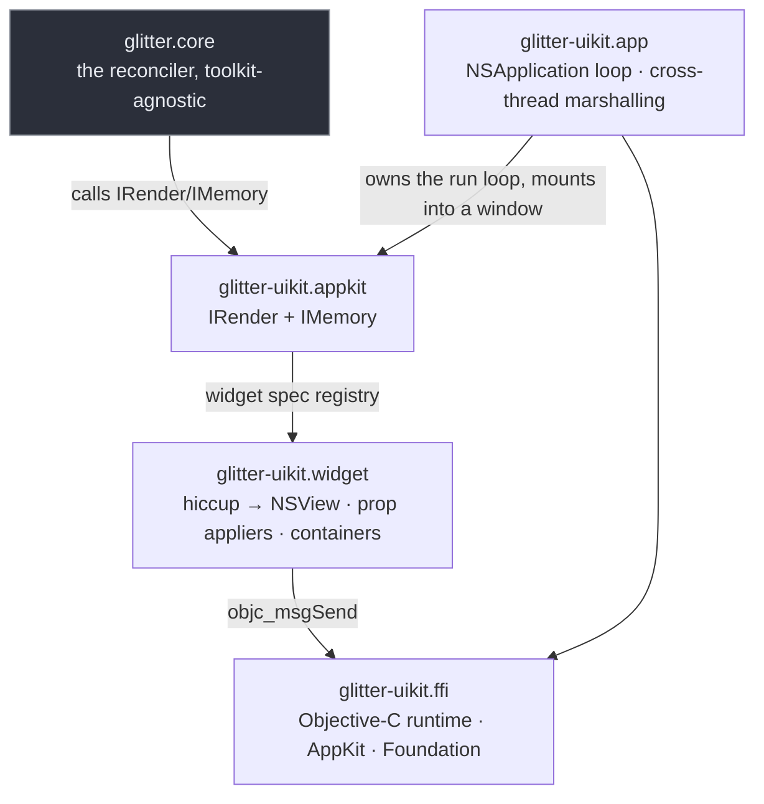

# Contributing to glitter-uikit

The conventions, gotchas and build commands for working in this repo. Read the
"Conventions & gotchas" section before changing the widget or renderer layers —
several entries there are the opposite of what a GTK background would suggest,
and each one is written down because it cost real debugging to find.

## What this is

An AppKit (native macOS) renderer for
[glitter](https://github.com/jlt-commons/glitter) (a Replicant-style Clojure UI
library on [Jolt](https://github.com/jolt-lang/jolt)), ported from
[glimmer-uikit](https://github.com/jolt-lang/glimmer-uikit) — the same
renderer for [glimmer](https://github.com/jolt-lang/glimmer), glitter's
Reagent-style sibling. A data-driven registry maps hiccup tags to AppKit
views (`NSWindow`, `NSStackView`, `NSButton`, `NSTextField`, etc.) and
prop/event wiring is driven through glitter's `IRender`/`IMemory`
protocols.

Repo: `git@github.com:jlt-commons/glitter-uikit.git`. Own copyright (2026,
Burin Choomnuan) — vendors ported code under `NOTICE.md`'s file-by-file
attribution, not a fork of glimmer-uikit or jolt-lang.

The deep documentation lives in [`docs/guide/`](docs/guide/index.md) and is
published at <https://jlt-commons.github.io/glitter-uikit/>. Edit the Markdown
here, never the site.

Publishing is automatic. `.github/workflows/site.yml` builds the site on every
pull request and deploys it when your change lands on `main`, so a docs change
goes live on merge without anyone running anything. You can preview it locally
with `bb site:serve` if you clone
[jlt-commons/docs-engine](https://github.com/jlt-commons/docs-engine) alongside
this repo, but the pull request build is the authority.

## Build & run

Requirements: [Jolt](https://github.com/jolt-lang/jolt), macOS 10.13+
with Xcode Command Line Tools, and GTK4 + GLib (via `../glitter`'s
`deps.edn` — see README's Status section for the limitation and its fix).

```
jolt -M:test                        # unit suite (headless; prints its own totals)
jolt -M:counter                     # interactive counter
jolt -M:todo                        # interactive task board
jolt -M:smoke                       # basic smoke test (live AppKit loop)
jolt -M:keyed-smoke                 # keyed reorder (live AppKit order)
jolt -M:replace-child-smoke         # child replacement (position preserved)
jolt -M:insert-before-smoke         # child insertion (live AppKit order)
jolt -M:handler-cleanup-smoke       # event handler lifecycle
jolt -M:main-thread-smoke           # off-thread state changes render on-thread
jolt -M:reactivity-smoke            # live state-atom reactivity
jolt -M:repl-live-smoke             # nREPL live editing
```

**In CI, invoke the `-M:<alias>` form, not the task form** —
`jolt -M:test`, `jolt -M:counter`, and so on — same non-propagating-exit-code
caveat glitter itself documents (verified against jolt v0.6.3). `bb.edn`'s
tasks already do this: `bb test`, `bb counter`, `bb smoke`, etc. are CI-safe.
Run `bb info` for the full grouped task list.

**Quality tooling** (`bb lint`/`lint:strict`, `bb lsp:format`/`format-check`,
`bb lsp:clean-ns`/`clean-ns-check`, `bb lsp:diagnostics`/`check`/`fix`, `bb
verify`, `bb hooks:install`/`:install:full`/`:uninstall`, `bb nrepl`): needs
`clj-kondo` and `clojure-lsp` on `PATH`. `.clj-kondo/hooks/jolt_ffi.clj`
(adapted from glitter-gl's own, which in turn credits glitter and b12n-rljlt —
see `docs/guide/porting-and-attribution.md`) rewrites `jolt.ffi/defcfn` so
clj-kondo/clojure-lsp can see through the FFI macro. `bb verify` is a manual
pre-commit gate: lint (report only) + `jolt -M:test` (must pass) — it does NOT
check formatting. The installed git hook (`bb hooks:install`) is a separate,
automatic gate that runs on every `git commit`: lint errors-only +
`clojure-lsp format --dry` + `clojure-lsp clean-ns --dry` (FAST), or the same
plus `jolt -M:test` (`hooks:install:full`). Running `bb verify` clean does not
guarantee the git hook will also pass — format drift is only caught by the
hook, not by `verify`.

## Architecture



- `glitter-uikit.ffi` contains all Objective-C FFI bindings and low-level
  AppKit wrappers.
- `glitter-uikit.widget` maps **nineteen tags** to their AppKit views — v1's
  `:window`, `:box`/`:hbox`/`:vbox`, `:button`, `:label`, `:entry`,
  `:checkbutton`, `:separator`, `:frame`, `:scrolled`, plus `:drop-down`,
  `:scale`, `:spin-button`, `:progress-bar`, `:level-bar`, `:switch`,
  `:password-entry`, `:search-entry`, `:image` and `:canvas` and implements the prop/container
  lifecycle. Unlike glitter.gtk, this layer carries NO event-signal
  wrapping (glitter.core calls `glitter-uikit.appkit`'s `IRender`
  directly) and NO suppression set (AppKit setters are silent).
- `glitter-uikit.appkit` implements `IRender` and `IMemory`, driving
  widget construction/update through the widget spec registry and routing
  events through glitter's dispatch.
- `glitter-uikit.app` handles the `NSApplication` event loop and window
  lifecycle.

Full topic breakdown: `docs/guide/index.md`.

## File map

| File | Role |
|---|---|
| `src/glitter_uikit/ffi.clj` | AppKit/Foundation FFI bindings (`jolt.ffi/defcfn` forms) |
| `src/glitter_uikit/widget.clj` | Hiccup tag → NSView mapping; widget spec registry; prop appliers; container strategies (ordered box vs. single-child window/frame/scrolled) |
| `src/glitter_uikit/appkit.clj` | `IRender` protocol (create/update/remove/insert-before); `IMemory` protocol (ref management); glitter.core integration |
| `src/glitter_uikit/app.clj` | `NSApplication` event loop and cross-thread marshalling; `run` builds a window and calls the caller's `on-activate` to mount into it (mounting itself is `glitter-uikit.appkit/mount!`, not this namespace). No `-main` here — see the `examples/*` entries below for that |
| `examples/glitter_uikit/counter.clj` | Counter demo — state atom + view function + action dispatch |
| `examples/glitter_uikit/widgets.clj` | Widget-gallery demo — every registered tag in one window; the only example that uses `:separator` or `:scrolled` |
| `examples/glitter_uikit/temperature.clj` | 7GUIs Temperature Converter — two linked fields; domain logic ported unchanged from glitter |
| `examples/glitter_uikit/flights.clj` | 7GUIs Flight Booker — `:drop-down`, validated date fields, constraint-gated Book button |
| `examples/glitter_uikit/timer.clj` | 7GUIs Timer — repeating `NSTimer` via `widget/every!`, `:progress-bar` + live `:scale` |
| `examples/glitter_uikit/crud.clj` | 7GUIs CRUD — prefix filter, selectable list built from `:button` rows, Create/Update/Delete |
| `examples/glitter_uikit/circles.clj` | 7GUIs Circle Drawer — `:canvas` + CALayer circles, click-to-place, undo/redo |
| `examples/glitter_uikit/todo.clj` | Task-board demo — derived counts, entry/checkbox list |
| `examples/glitter_uikit/smoke.clj` | Basic smoke: mount a tree and run the loop without exception |
| `examples/glitter_uikit/keyed_smoke.clj` | Keyed reorder — verifies live AppKit widget order via `glitter-uikit.widget/stack-children` (reads `arrangedSubviews`, not GTK4's `-firstChild`/`-nextSibling`) |
| `examples/glitter_uikit/replace_child_smoke.clj` | Replaced child stays at its position, not the end |
| `examples/glitter_uikit/insert_before_smoke.clj` | Child insertion — live AppKit order |
| `examples/glitter_uikit/handler_cleanup_smoke.clj` | Event handler lifecycle — wiring/unwiring on mount/update/unmount |
| `examples/glitter_uikit/main_thread_smoke.clj` | Off-thread state changes render on the NSApplication main thread |
| `examples/glitter_uikit/reactivity_smoke.clj` | Live state-atom reactivity — view recomputes on atom changes |
| `examples/glitter_uikit/repl_live_smoke.clj` | nREPL-driven live editing — redefine functions and hot-reload |
| `test/glitter_uikit/*_test.clj` | Unit suite covering `ffi.clj`, `widget.clj` (`widget_test.clj` and `container_test.clj`), and `appkit.clj`, plus `scaffold_test.clj` for the `:local/root` glitter dependency. `app.clj` has no dedicated test file |
| `test/glitter_uikit/test_runner.clj` | Test-suite entry point (`jolt -M:test`) |

Full provenance (which file ported from where, every documented deviation):
`NOTICE.md`.

## Conventions & gotchas (do not regress these)

1. **Events are DATA, never closures.** All handlers are vectors of action
   tuples dispatched through a single global `glitter.core/set-dispatch!`
   function, never lambda closures. Contrast glimmer's Reagent-style
   component-local closures: glitter uses Replicant's state-atom + pure-view
   + data-driven-dispatch model. Example: `[:button {:label "Click"
   :on {:click [[:action/do-something arg]]}}]`, NOT `[:button {:label
   "Click" :on {:click (fn [] ...)}}]`. glitter.hiccup's `hiccup?` check
   rejects a non-keyword tag and renders it as a stringified literal object
   instead of throwing — the same silent bug class this codebase hit
   historically (see glitter's `AGENTS.md` convention #10 for the full
   story).

2. **`:ctor` never sees props.** `glitter.core`'s reconciler calls a widget
   spec's `:ctor` with only an `{:ns ns-hint}` map (see `glitter.core:646`,
   line: `(when ns {:ns ns})`), and passes real props through a separate
   path later via `:apply`. Every prop, including those needed at
   construction time (a label's `:label` text, a button's `:label`), must be
   handled in `:apply` instead. Verified against the actual reconciler code
   path in glitter.core.

3. **Never add a suppression set.** glitter.gtk carries a `suppressing` atom
   because GTK's programmatic setters (like `gtk_editable_set_text`)
   synchronously re-emit their own signal, which would feed a re-render back
   into app dispatch. AppKit does NOT fire action or delegate callbacks for
   programmatic `setState:`/`setStringValue:`/etc., so there is nothing to
   suppress and no such set exists here. This absence is intentional — do not
   add one. The property is asserted live by
   `examples/glitter_uikit/keyed_smoke.clj`.

4. **`insert-before` is single-branch on purpose, but the index is
   post-removal, not a DOM reference node.** Unlike glitter.gtk, which
   branches on whether a child is already tracked in the parent's children
   list (reorder vs. insert), glitter-uikit's `insert-before` is a single
   code path — AppKit's `insertArrangedSubview:atIndex:` automatically moves
   an already-parented subview instead of asserting it's unparented like GTK
   does. It is NOT DOM `insertBefore`, though: the call is remove-then-insert
   internally and the index is interpreted against the POST-removal array, so
   a forward move (child currently before the target sibling) must use the
   un-incremented sibling index, not `(inc i)`. See
   `docs/guide/appkit-widget-layer.md`'s "Where AppKit is simpler" section for
   the measured behavior and evidence.

5. **Every index read goes through `arranged-index`.** The hazard is a
   WRITE, not a read: `indexOfObject:` returns `NSNotFound` (which is
   `NSIntegerMax`, not `-1`) for a non-member, and feeding
   `NSNotFound + 1` to `insertArrangedSubview:atIndex:` raises an
   uncatchable `NSException` that **aborts the process** — a Clojure
   `catch :default` does not intercept it, because Objective-C exceptions
   do not unwind into Scheme. `arranged-index` guards every index read by
   returning `nil` for "absent" instead of a sentinel that could reach
   that arithmetic.

6. **Never `(resolve 'System/exit)`.** It is always nil in Jolt.
   Call `System/exit` directly or the smoke that needs an exit code will exit
   0. Verified live — a smoke that catches exceptions and tries to exit with
   a non-zero code via `(when-let [exit (resolve 'System/exit)] (exit 1))`
   silently exits 0.

7. **macOS `sed` is BSD and has no `\b` word boundary.** Use literal tokens or
   GNU `sed` (installed via Homebrew as `gsed`). E.g., replace `sed
   's/\bfoo\b/bar/g'` with `gsed 's/\bfoo\b/bar/g'` or `sed 's/foo/bar/g'` if
   the context is already specific enough.

8. **Prefer running the live smokes over reasoning about AppKit view-tree
   behavior in the abstract.** AppKit is a live, stateful system with a
   blocking main loop. Several of this port's most important facts —
   `insertArrangedSubview:atIndex:` auto-moving a subview,
   `removeArrangedSubview:` leaving a plain subview behind, every index read
   needing bounds-checking — were discovered and verified by actually running
   against live AppKit state, not by reading documentation or reasoning from
   GTK analogies. GTK and AppKit have subtly different semantics in exactly
   these areas, and the live smokes are the ground truth.

9. **The glitter-core split is the standing follow-up.** Extracting a
   natives-free `glitter-core` (cross-link README's Status section) is
   recorded in `CONTRIBUTING.md` at dispatch time as context for any future
   contributor picking up that arc.

## Scope (shipped)

The full AppKit renderer for glitter: **nineteen widget tags**.

v1's nine — `:window`, `:box`/`:hbox`/`:vbox`, `:button`, `:label`, `:entry`,
`:checkbutton`, `:separator`, `:frame`, `:scrolled` — mapped to `NSWindow`,
`NSStackView`, `NSButton`, `NSTextField` in various styles, `NSBox` and
`NSScrollView`.

Nine added since, sourced from the AppKit headers in the local macOS SDK:
`:drop-down` (`NSPopUpButton`), `:scale` (`NSSlider`), `:spin-button`
(`NSStepper`), `:progress-bar` (`NSProgressIndicator`), `:level-bar`
(`NSLevelIndicator`), `:switch` (`NSSwitch`), `:password-entry`
(`NSSecureTextField`), `:search-entry` (`NSSearchField`) and `:image`
(`NSImageView`). Tag, prop and event names are glitter's own GTK-side ones, so
a view ports between renderers unchanged.

Plus one tag with no glitter counterpart: `:canvas` (an `NSButton` whose CALayer
holds free-positioned shapes), added for the 7GUIs Circle Drawer.

Eight live-AppKit smokes (keyed reorder, child replacement/insertion, handler
lifecycle, main-thread rendering, state-atom reactivity, nREPL live editing,
plus the basic smoke) plus the full unit suite. Eight interactive demos (counter, widget gallery, the 7GUIs Temperature
Converter, Flight Booker, Timer, CRUD and Circle Drawer, task board) — 7GUIs
tasks 1 through 6, one further than glitter itself ships.

Known v1 limitations, inherited unmodified from glimmer-uikit: `:class`
and `:style` props are silently accepted but do nothing (AppKit has no
CSS), and there is no validation on `:style` contents at all. (Unrelated
to `:style`: this port DOES validate a label's `:markup` prop against
Pango's tag/attribute vocabulary — `markup-validate!`, `widget.clj`, pinned
by `markup-rejects-things-pango-cannot-parse` — the same validation
glitter.gtk performs for its own `:markup` prop.) The `insert-before`
single-branch design (see gotcha #4) means keyed re-orders work but the
single-branch shape (no reorder API separate from insert) is less obvious
than GTK's explicit `gtk_box_reorder_child_after` call.
