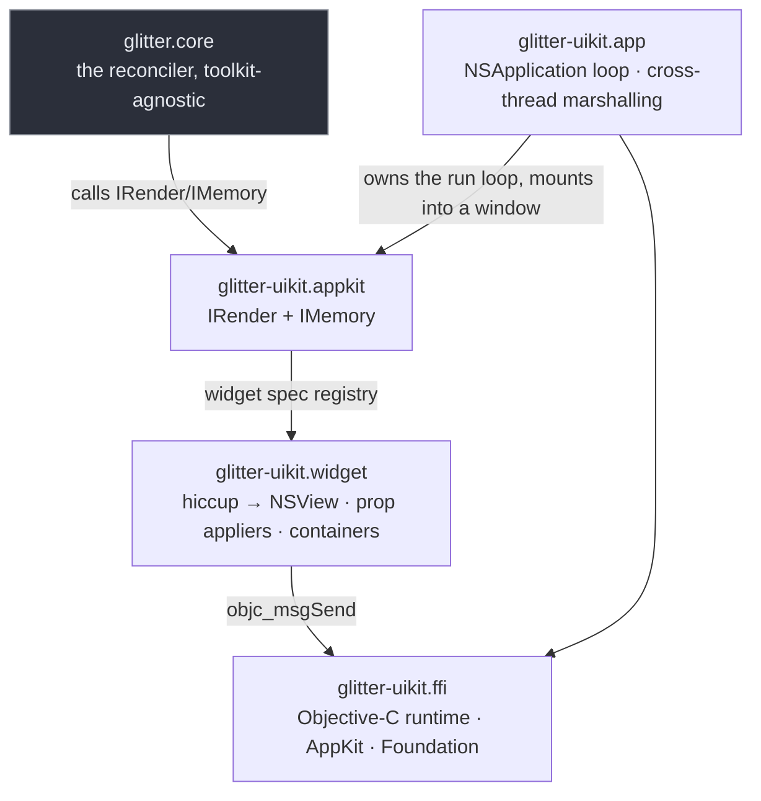

# glitter-uikit

An AppKit (native macOS) renderer for
[glitter](https://github.com/jlt-commons/glitter) — a Replicant-style Clojure UI
library on [Jolt](https://github.com/jolt-lang/jolt). Ported from
[glimmer-uikit](https://github.com/jolt-lang/glimmer-uikit), which does the
same for [glimmer](https://github.com/jolt-lang/glimmer) (glitter's
Reagent-style sibling). A data-driven registry maps hiccup tags to AppKit
views, and glitter's reconciler drives prop/event wiring through the
`IRender`/`IMemory` protocols.

**Documentation:** <https://jlt-commons.github.io/glitter-uikit/>

[](docs/guide/examples.md)

*The counter demo, running as a real AppKit window. More screenshots
(and what each one demonstrates about the model) in the
[examples gallery](docs/guide/examples.md).*

## Requirements

**macOS 10.13+** with **Xcode Command Line Tools** (provides `clang`,
`ld`, and frameworks).

**No GTK4.** This renderer depends on
[`glitter-core`](https://github.com/jlt-commons/glitter-core) directly —
the toolkit-agnostic half of glitter (`core`, `protocols`, `hiccup`,
`vdom`, `alias`, `assert`, `asserts`, `errors`, `console-logger`, `env`)
— rather than the full `glitter` package, which declares GTK4/GLib under
`:jolt/native`. See the Status section below for the history of this
fix.

## Quick start

```clojure
(require '[glitter-uikit.app :as app]
         '[glitter-uikit.appkit :as appkit]
         '[glitter.core :as core])

(defonce state (atom {:count 0}))

(defn view [{:keys [count]}]
  [:vbox {:spacing 12}
   [:label {:label (str "Count: " count)}]
   [:hbox {:spacing 8}
    [:button {:label "− 1" :on {:click [[:action/dec]]}}]
    [:button {:label "+ 1" :on {:click [[:action/inc]]}}]
    [:button {:label "reset" :on {:click [[:action/reset]]}}]]])

(defn execute-actions [_event actions]
  (doseq [[kind] actions]
    (case kind
      :action/inc (swap! state update :count inc)
      :action/dec (swap! state update :count dec)
      :action/reset (swap! state assoc :count 0)
      nil)))

(core/set-dispatch! execute-actions)

(defn -main [& _]
  (app/run (fn [window] (appkit/mount! window view state))
           :title "glitter-uikit counter" :width 320 :height 160))
```

Run via `jolt -M:counter`.

**In CI, invoke the `-M:<alias>` form, not the task form** — `jolt -M:test`,
`jolt -M:counter`, and so on — same non-propagating-exit-code caveat
[glitter's own README](https://github.com/jlt-commons/glitter#quick-start)
documents (verified against jolt v0.6.3).

## Running

```sh
jolt -M:test                        # unit suite (headless; prints its own totals)
jolt -M:counter                     # interactive counter
jolt -M:todo                        # interactive task board
jolt -M:smoke                       # basic smoke test (live AppKit loop)
jolt -M:keyed-smoke                 # keyed reorder (live AppKit order)
jolt -M:replace-child-smoke         # child replacement (position preserved)
jolt -M:insert-before-smoke         # child insertion (live AppKit order)
jolt -M:handler-cleanup-smoke       # event handler lifecycle
jolt -M:main-thread-smoke           # off-thread state changes render on-thread
jolt -M:reactivity-smoke            # live state-atom reactivity
jolt -M:repl-live-smoke             # nREPL live editing
```

Or via `bb`:

```sh
bb test              # jolt -M:test
bb counter           # interactive counter
bb todo              # interactive task board
bb smoke             # basic smoke test
bb keyed-smoke       # keyed reorder
bb replace-child-smoke  # child replacement
bb insert-before-smoke  # child insertion
bb handler-cleanup-smoke  # event handler lifecycle
bb main-thread-smoke    # off-thread state changes
bb reactivity-smoke     # live state-atom reactivity
bb repl-live-smoke      # nREPL live editing
```

## Dependency modes

`deps.edn` declares `glitter-core` and `nexus-jolt` as pinned git
coordinates (`io.github.jlt-commons/glitter-core` and
`io.github.jlt-commons/nexus-jolt`, each at a fixed `:git/sha`). jolt
fetches and builds against those exact commits, so a fresh clone of this
repo builds with no other setup — nothing needs to sit next to it on
disk:

```sh
jolt -M:counter          # builds against the pinned shas
```

There is no `:dev` alias for local co-development against sibling
checkouts at the moment — add one the same way `glitter`'s own
`deps.edn` does (an `:override-deps` entry per coordinate) if you need
it.

## Hiccup reference

glitter-uikit speaks a hiccup dialect where **events are data, never
closures**. A button's click handler is a vector of action tuples to
dispatch, not a function:

```clojure
;; ✓ data-driven event, glitter-style
[:button {:label "Click me" :on {:click [[:action/do-something arg]]}}]

;; ✗ closure-based event, not supported
[:button {:label "Click me" :on {:click (fn [] ...)}}]
```

**Event key change: `:on-click` → `:on {:click ...}`.**  Adapt from
glimmer-uikit's docs by substituting `:on {:click ...}` for every instance
of `:on-click` and similar `:on-*` keys. All events go in a single `:on`
map.

**`:class` and `:style` are inert.** AppKit has no CSS — these keys are
accepted to keep hiccup trees portable, but they do nothing. There is no
AppKit equivalent of GTK's `gtk_widget_add_css_class`.

See `CONTRIBUTING.md` for the full event-dispatch architecture and `docs/guide/`
for widget-layer mechanics.

## Architecture



Four namespaces:

- `glitter-uikit.ffi` — AppKit/Foundation FFI layer via `jolt.ffi`.
- `glitter-uikit.widget` — hiccup tag → NSView mapping, prop appliers,
  container strategies (`:box` ordered, `:window`/`:frame`/`:scrolled`
  single-child), event handler lifecycle.
- `glitter-uikit.appkit` — `IRender`/`IMemory` protocols, glitter.core
  integration.
- `glitter-uikit.app` — macOS event loop and app lifecycle (`NSApplication`).

See `docs/guide/index.md` for the full breakdown.

## Documentation

- **[`docs/guide/index.md`](docs/guide/index.md)** — the full guide.
- **[`CONTRIBUTING.md`](CONTRIBUTING.md)** — conventions, gotchas, build
  commands and the file map. Read it before changing the widget or renderer
  layers.
- Design spec and implementation plan are kept in a private planning store and
  are not part of this repository.

## Status

Ported from glimmer-uikit v0.1.0 (2026-08-20 arc) — see `NOTICE.md` for the
full verbatim/adapted/new breakdown, including the defects fixed during the
port (carried from upstream, plus one the port's own new code introduced)
and the AppKit behaviors measured rather than assumed.

**Fixed 2026-09-17 — no more GTK4 requirement.** glitter's `deps.edn`
declares GTK4/GLib under `:jolt/native`, and jolt inherits a
dependency's natives transitively and hard-fails before any namespace
loads if one is missing — so a glitter-uikit app needed GTK4 installed
even though it renders through AppKit and never calls a GTK function.
An `:aliases`-scoped `:jolt/native` was verified to be silently ignored,
so there was no way to scope it away from this side. The fix was
extracting a natives-free
[`glitter-core`](https://github.com/jlt-commons/glitter-core) —
the toolkit-agnostic half of glitter (`core`, `protocols`, `hiccup`,
`vdom`, `alias`, `assert`, `asserts`, `errors`, `console-logger`, `env`)
plus a standalone [`nexus-jolt`](https://github.com/jlt-commons/nexus-jolt)
(the dispatch engine, `glitter.nexus`/`glitter.nexus.registry` renamed to
match upstream `nexus.core`/`nexus.registry`) — the same split upstream
glimmer made at its own v0.1.0. This package now depends on both
directly instead of on the full `glitter`. `weavejester/hiccup` and
`clojure.tools.logging`, previously arriving transitively through
`glitter`, are declared here directly now that `glitter` is no longer in
the dependency graph. `glitter-gl` still depends on the full `glitter`
package and keeps the GTK4 requirement — it genuinely registers a GTK
widget, unlike this renderer, so the same fix doesn't apply there.

## Licence

Copyright (c) 2026 Burin Choomnuan.

glitter-uikit's own code is distributed under the
[Eclipse Public License 2.0](LICENSE), matching the rest of jlt-commons and jolt
itself. SPDX identifier: `EPL-2.0`. It was MIT until 2026-09-05.

That grant covers this project's own code only. The files ported from
glimmer-uikit are a separate question, recorded accurately in
[`NOTICE.md`](NOTICE.md) and in the
[porting and attribution guide](docs/guide/porting-and-attribution.md): at
the commit actually ported from (2026-08-20), upstream shipped no LICENSE
file, so no grant was made for them, and nothing here claims otherwise.
**Note as of 2026-09-18:** `jolt-lang/glimmer-uikit` was recreated on
2026-09-13 as an unrelated codebase by a different author, now under MIT —
that grant does not extend to the code actually forked here, which the live
upstream URL no longer even shows. See `NOTICE.md` for the full detail.
